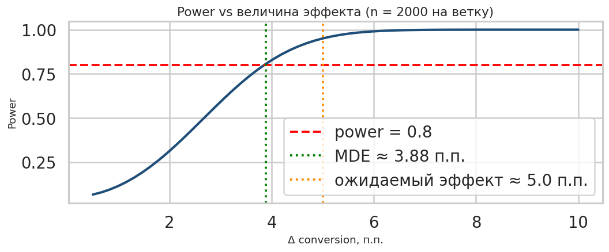
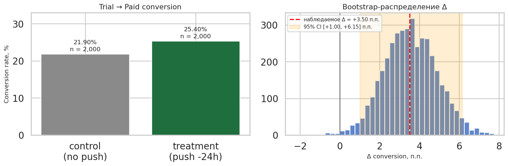
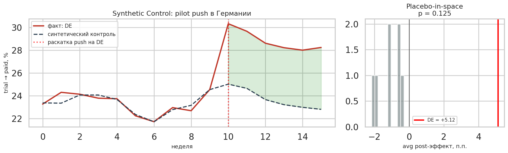

# A/B-тест: push-напоминание перед окончанием trial у VPN-сервиса

## Контекст

У меня некоторое время работал VPN-сервис(Berserk VPN) с моделью **7-дневный бесплатный trial → платная подписка $4.99/месяц** (auto-billing после trial). Воронка простая: реклама → регистрация → trial → оплата.

Проблема: после конца trial многие пользователи отключали auto-renew или просто забывали продлить. Хотелось проверить, поможет ли явное напоминание.

## Гипотеза

Push-уведомление за **24 часа до окончания trial** напоминает пользователю о фиче и повышает конверсию trial → paid. Эффект ожидаю не огромный (≈5 п.п.), но при моей базе это уже значимо для выручки.

**Целевая метрика — `conversion = trial → paid`** (binary). Это главная метрика воронки SaaS.

Гуардрейл — `uninstall_rate` после получения push (чтобы не превратить фичу в спам, который выгоняет пользователей).

## Дизайн эксперимента

| Параметр | Значение |
|---|---|
| Целевая метрика | conversion (trial → paid) |
| Период | ~2 недели набора, 7 дней trial = всего ~3 недели |
| Размер выборки | 2000 пользователей на ветку (4000 всего) |
| Сплит | 50/50 рандомный по `user_id` |
| Группа A (control) | trial без напоминания |
| Группа B (treatment) | push за 24h до конца trial |
| α | 0.05, power 0.8 |
| Бонус | Synthetic Control для пилота фичи на Германию |

## Расчёт мощности

Маленький продукт, бюджет ограничивает n. Поэтому считаем не MDE-first, а трафик-first: при `n = 2000` на ветку и baseline conversion ~23%, мы способны зафиксировать эффект от **~3.9 п.п.** и выше.

Ожидаемый эффект (5 п.п.) попадает в зону уверенной детекции. Тест проводить можно.

## Результаты

| Метрика | A (no push) | B (push −24h) | Δ |
|---|---|---|---|
| Пользователей | 2 000 | 2 000 | — |
| Платных конверсий | 438 | **508** | **+70** |
| **Conversion** | **21.9%** | **25.4%** | **+3.5 п.п.** |
| Доп. MRR / 1000 пользователей | — | — | **+$175** |

**Стат-тесты:**
- z-test для пропорций: z = 2.61, **p = 0.0092** < 0.05 → отвергаем H0
- Bootstrap 95% CI на Δ: **[+1.0, +6.2] п.п.** — левый конец > 0
- OLS с ковариатами (возраст, источник трафика, активность в trial, страна) и HC3 SE: ATE = **+3.4 п.п.**, CI [+0.7, +6.0]

SRM проверка прошла (χ² = 0.00, p = 1.0), баланс ковариат тоже OK (p > 0.7 на возрасте, активности, источнике трафика). Рандомизация честная.

## Synthetic Control: pilot push на Германию

После успешного A/B решил раскатить фичу не сразу везде, а сначала на одну страну — **DE** (Германия) — и сравнить с тем, что было бы без раскатки. Беру недельный conversion rate по 8 странам, фичу включаю на 10-й неделе. Синтетический контроль для DE строю из остальных 7 стран.

- Веса донорского пула: US (0.34) + FR (0.30) + PL (0.13) + остальные мелочи
- Средний gap пост-периода: **+5.1 п.п.** — устойчиво выше синтет-клона
- Placebo-in-space: pseudo-p = 0.125 (DE — №2 по силе эффекта среди всех unit'ов)

SC даёт оценку чуть больше, чем A/B (+5.1 vs +3.5), но обе оценки лежат в одном порядке, направление совпадает. SC валидирует, что эффект не артефакт рандомизации.

## Вывод

Гипотеза подтверждена. Push-напоминание за 24ч до конца trial:

- **повышает trial-to-paid конверсию с 21.9% до 25.4%** (+3.5 п.п., p < 0.01);
- даёт **+$175 MRR на каждые 1000 trial-пользователей** при текущем ARPU;
- эффект устойчив при контроле ковариат (возраст, источник, активность);
- независимо подтверждён synthetic control на гео-пилоте (+5.1 п.п.).

**Решение: катить пуш на всех пользователей.**

Следующий тест в очереди — попробовать **второе** напоминание за 1 час до списания (для тех, кто не открыл первый push). Гипотеза — добавит ещё 1–2 п.п. при том же бюджете.
